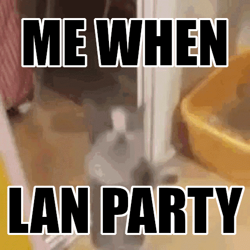

<div align="center" id="top"> 
  

  &#xa0;

  <!-- <a href="https://landex.netlify.app">Demo</a> -->
</div>

<h1 align="center">LANdex</h1>

<p align="center">
  

  

  

  

  <!--  -->

  <!--  -->

  <!--  -->
</p>

<!-- Status -->

<!-- <h4 align="center"> 
	🚧  LANdex 🚀 Under construction...  🚧
</h4> 

<hr> -->


<p align="center">
  <a href="#dart-about">About</a> &#xa0; | &#xa0; 
  <a href="#sparkles-features">Features</a> &#xa0; | &#xa0;
  <a href="#rocket-technologies">Technologies</a> &#xa0; | &#xa0;
  <a href="#white_check_mark-requirements">Requirements</a> &#xa0; | &#xa0;
  <a href="#checkered_flag-starting">Starting</a> &#xa0; | &#xa0;
  <a href="#memo-license">License</a> &#xa0; | &#xa0;
  <a href="https://github.com/JershBytes" target="_blank">Author</a>
</p>

> [!WARNING] 
> The code in this project was generated using Co-Pilot. This is never meant to hit production and is very much a homelab tool for lan party's.

<br>

## :dart: About ##

🖧 LANdex is a lightweight web app for listing and browsing game servers at a LAN party. Built for quick setup and zero fuss — just hosts, IPs, and fragging.

## :sparkles: Features ##

:heavy_check_mark: Modern Vite + React UI with Monokai Spectrum-inspired theme;\
:heavy_check_mark: Public server list for easy LAN discovery;\
:heavy_check_mark: Admin login with secure .env credentials;\
:heavy_check_mark: Add and delete servers (admin only);\
:heavy_check_mark: Copy server IP with one click;\

## :rocket: Technologies ##

The following main tools and frameworks power this project:

- [Vite](https://vitejs.dev/) (frontend tooling)
- [React](https://react.dev/) (UI framework)
- [Express](https://expressjs.com/) (backend API)
- [Node.js](https://nodejs.org/en/) (runtime)

## :white_check_mark: Requirements ##

Before starting :checkered_flag:, you need to have [Git](https://git-scm.com) and [Node](https://nodejs.org/en/) installed.

## :checkered_flag: Starting ##

### Development

```bash
# Clone this project
$ git clone https://github.com/JershBytes/landex

# Access
$ cd landex

# Install dependencies (from the root, installs all workspaces)
$ npm install

# Run the project
$ npm run dev

# The server will initialize in the <http://localhost:5173>
```

### Docker Compose
```bash
# Clone this project
$ git clone https://github.com/JershBytes/landex

# Access
$ cd landex

# Create .env file with your auth credentials
$ cp .env.example .env
# Edit .env and set your ADMIN_USERNAME and ADMIN_PASSWORD

# Build and run with Docker Compose
$ docker compose up -d

# The app will be available on port 3000 (or as configured in docker-compose.yml)
```

The Docker setup includes:
- Multi-stage build for optimized image size
- Named volume for persistent `servers.json` storage
- Environment variable support for admin credentials
- Health checks for container monitoring

## :memo: License ##

This project is under license from MIT. For more details, see the [LICENSE](LICENSE.md) file.


Made with :heart: by <a href="https://github.com/JershBytes" target="_blank">Joshua Ross</a>

&#xa0;

<a href="#top">Back to top</a>
